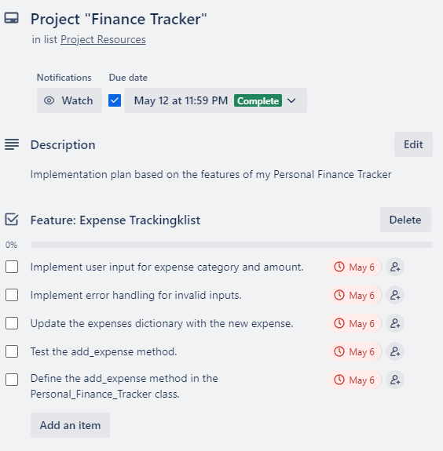
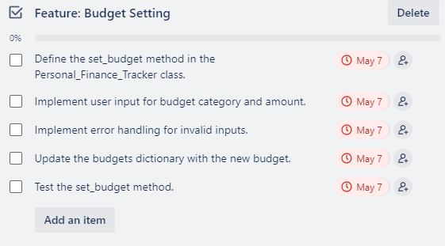
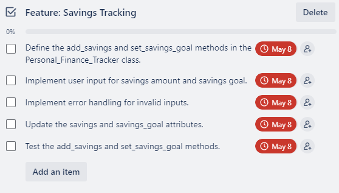
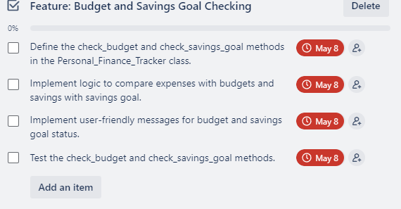
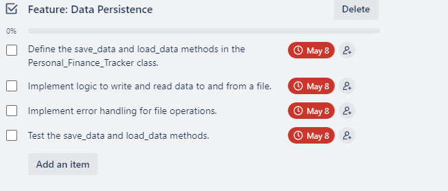
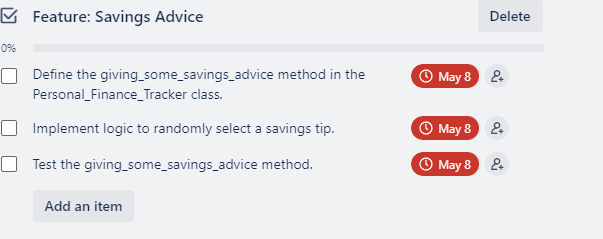

# Personal Finance Tracker

## Introduction

This README.md document serves as the guide for the Personal Finance Tracker application. Below are the details and documentation requirements for the application.

## Full Attribution

- The code for the Personal Finance Tracker application was written by Mina Bishay.
- The application utilises the following libraries/modules:
  - [pytest](https://pytest.org/) for testing purposes.
  - [json](https://docs.python.org/3/library/json.html) for working with JSON data.
  - [random](https://docs.python.org/3/library/random.html) for generating random tips.
  - [os](https://docs.python.org/3/library/os.html) for interacting with the operating system.
  - [unittest.mock](https://docs.python.org/3/library/unittest.mock.html) for mocking objects in unit tests.
  - [PEP 8](https://www.python.org/dev/peps/pep-0008/) style guide is followed for code formatting.

### Source Control Repository

The source code for the Personal Finance Tracker application can be found in the following GitHub repository:
[Personal Finance Tracker Repository](https://github.com/Minabishay123/MinaBishay_T1A3)

#### Code Style Guide

The application adheres to the PEP 8 style guide for Python code.

#### Features

1. **Expense Tracking**

   - **Description:** Users can add and track expenses by category. The application prompts the user to input expense categories and amounts. It then checks if the expenses exceed the set budget for each category and provides a warning if necessary.
   - **Walkthrough:**
     - User inputs expense categories and amounts.
     - Application checks if expenses exceed the budget for each category.
     - If expenses exceed the budget, a warning message is displayed.

2. **Budget Setting**

   - **Description:** Users can set budgets for different expense categories. The application prompts the user to input budget categories and amounts.
   - **Walkthrough:**
     - User sets budget for each expense category.
     - Application stores the budget for each category.

3. **Savings Management**
   - **Description:** Users can add savings and set a savings goal. The application prompts the user to input the amount of savings and the savings goal. It then checks if the savings meet or exceed the savings goal.
   - **Walkthrough:**
     - User inputs the amount of savings and sets a savings goal.
     - Application checks if savings meet or exceed the savings goal.
     - Application provides feedback based on the comparison.

#### Implementation Plan

Feature: Expense Tracking

**Tasks:**



Feature: Budget Setting

- **Tasks:**



Feature: Savings Tracking

- **Tasks:**



Feature: Budget and savings goal checking

- **Tasks:**



Feature: Data Persistence

- **Tasks:**



Feature: Savings Advice

- **Tasks:**



#### Help Documentation

#### Installation

1. **Clone the Repository:**

   - Open your terminal or command prompt.
   - Navigate to the directory where you want to install the application.
   - Run the following command to clone the repository:

     ```Bash
     git clone https://github.com/Minabishay123/MinaBishay_T1A3.git
     ```

2. **Navigate to Project Directory:**

   - Change directory to the cloned repository:

     ```Bash
     cd MinaBishay_T1A3
     ```

   - Create a virtual environment for your project

     ```Bash
     python3 -m venv .venv
     ```

3. **Open in VS Code:**

   - In your console enter the following:

     ```Bash
     MinaBishay_T1A3$ code .
     ```

4. **Open Terminal:**

   - Use the "Terminal" menu or the shortcut `Ctrl ~` to open a new terminal window within VSCode.

5. **Run the Application:**

   - In the terminal window, navigate to the project directory if not already there.

     ```Bash
     cd src
     ```

   - Run the main script using the following command:

     ```Bash
     python finance_tracker.py
     ```

6. **Create Executable:**

   - If you are using **PyInstaller**; in the terminal, navigate to the project directory if not already there.
   - Run the following command to create an executable file:

     ```Bash
     pyinstaller finance_tracker.py --onefile --name finance_tracker
     ```

   - This command will generate a `dist` directory in the project folder containing an executable file named `finance_tracker`.

   **Using cx_Freeze:**

   - Install the `cx_Freeze` library if you haven't already:

     ```Bash
     pip install cx-Freeze
     ```

   - Create a `setup.py` script in the project directory with the following contents:

     ```python
     from cx_Freeze import setup, Executable

     setup (
         name="finance_tracker",
         version="1.0",
         description="Personal Finance Tracker Application",
         executables=[Executable("finance_tracker.py")],
         )
     ```

   - Run the following command to create an executable:

     ```Bash
     python setup.py build
     ```

   **Using py2exe:**

   - Install the `py2exe` library if you haven't already:

     ```Bash
     pip install py2exe
     ```

   - Create a `setup.py` script in the project directory with the following contents:

     ```python
     from distutils.core import setup
     import py2exe

     setup(
       console=['finance_tracker.py'],
       options={
           'py2exe': {
               'bundle_files': 1,
               'compressed': True,
           }
       },
       zipfile=None,
     )
     ```

   - Run the following command to create an executable:

     ```Bash
     python setup.py py2exe
     ```

7. **Run as Executable:**

   - Once the application starts, follow the on-screen instructions to interact with it.
   - Use keyboard input to input expense categories, amounts, budgets, savings, and savings goals as prompted.
   - Press `Enter` after each input to proceed.

   - Navigate to the `dist` directory in the project folder.
   - Depending on your operating system, use one of the following methods to run the executable:

     **Ubuntu/Linux:**

     ```Bash
     ./finance_tracker
     ```

     **Windows PowerShell:**

     ```Bash
     .\finance_tracker.exe
     ```

     **macOS Terminal:**

     ```Bash
     ./finance_tracker
     ```

8. **Interact with the Application:**

   - Once the application starts, follow the on-screen instructions to interact with it.
   - Use keyboard input to input expense categories, amounts, budgets, savings, and savings goals as prompted.
   - Press `Enter` after each input to proceed.

9. **Install Dependencies:**

   - The application requires Python 3.10 to be installed on your system. If you haven't installed Python yet, you can download it from the [official Python website](https://www.python.org/downloads/).

#### Dependencies

- Python 3.10
- [pytest](https://pytest.org/) for testing purposes.
- [json](https://docs.python.org/3/library/json.html) for working with JSON data.
- [random](https://docs.python.org/3/library/random.html) for generating random tips.
- [os](https://docs.python.org/3/library/os.html) for interacting with the operating system.
- [unittest.mock](https://docs.python.org/3/library/unittest.mock.html) for mocking objects in unit tests.

#### System/Hardware Requirements

- Compatible with Windows, macOS, and Linux operating systems.
- Sufficient memory and processing power to run Python applications.
